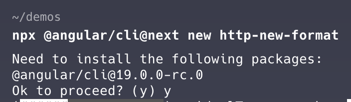
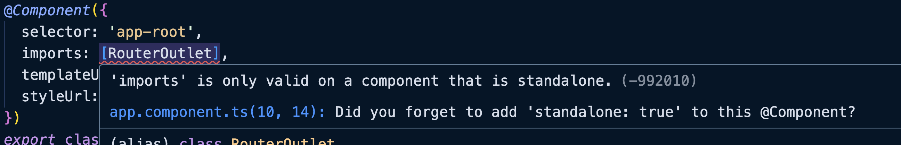

### Creación del proyecto 

`npx @angular/cli@next new http-new-format`




### Errores 

Si te aparece este error es porque no salio o no tenes actualizado el [Angular Language Service](https://marketplace.visualstudio.com/items?itemName=Angular.ng-template), en angular v19 todos los components son `standalone` por defecto.




#### paso 1 

Agregamos en `app.config.ts` la funcionalidad de http `provideHttpClient()`

```ts
export const appConfig: ApplicationConfig = {
  providers: [provideZoneChangeDetection({ eventCoalescing: true }), provideRouter(routes), provideHttpClient() ]
};
```

#### paso 2

inyectamos el `HttpClient` para hacer las llamadas en `app.component.ts`

```ts
http = inject(HttpClient);
```

---

Como haciamos la llamadas anteriormente, en un servicio tendriamos una funcion que llamaria a esto, obviamente que no es lo ideal hacer un subscribe directo, pero como siempre es a modo de ejemplo bien visual
Algo parecido a:

```ts
this.http
    .get('https://api.adviceslip.com/advice') // get a la url
    .subscribe( // hacemos la llamada
    (value: any) => { // seteamos el tipo del return
        this.advice = value.slip.advice; // usamos los datos
    }
    )
```

ahora tenemos nuevas formas de hacerlo y con ello vamos a movernos lentamente a signals, paso a paso hasta terminar sin mas rxjs.... hace mucho que lo vengo diciendo, tarde o temprano van a sacar a rxjs para volverlo "optativo".

## Resource

Y para esto aparece `resource`, que lo que nos genera es la posibilidad de manejar lo mismo que haciamos con rxjs pero con signals... sin tanto esfuerzo 

Si vamos a la descripcion de `resource` en el codigo fuente nos dice lo siguiente:

```md
Constructs a Resource that projects a reactive request to an asynchronous operation
 defined by a loader function, which exposes the result of the loading operation via signals.
```
Por lo tanto, resource lo que va a hacer es via `SIGNALS` generarnos todo lo necesario para el trabajo de nuestro request.
Ahora como funciona: 

```ts
this.adviceResource = resource({
      loader: () => fetch('https://api.adviceslip.com/advice')
        .then(res => res.json())
    })

    effect(() => {
      console.log('code' , ResourceStatus[this.adviceResource.status()]);
      console.log('value', this.adviceResource.value()?.slip.advice); 
    })
    
```

Aca como siempre podemos ver la forma mas facil y sencilla para un ejemplo, `resource` recibe como parametro un objeto, que dentro tiene loader, `loader` es una funcion anonima que nos permite tener un `fetch` (adios RXJS) que de lo que obtenemos vamos a hacer un then y obtener en nuestro caso el json directo.

Como podran ver, esto no esta ejecutandose por asi decirlo, no estamos haciendo mas que dar a un parametro esta nueva funcionalidad, pero lo que podemos hacer, que es parte de la `magia` de signals, es obtener las modificaciones dentro de un effect.

Tambien el punto importante, es que una vez que resuelva, lo que va a hacer es un `abortSignal` lo cual nos permite mejorar nuestro rendimiento de memoria sin tener cosas que ya no necesitamos

Ahora que podemos manejar estos efectos directamente como nostoros queramos, vamos a mostrar 2 cosas:
1 - que tenemos el status del `fetch` por lo tanto podemos usarlo para mostrar loaders o manejar cosas dentro de nuestras excepciones si llega a fallar.
2 - el retorno del valor, el cual sera undefined hasta que tenga un valor apropiado.

Recorda que el status se maneja por numeros, pero con la constante `ResourceStatus` que ya viene en `@angular/core` podemos obtener el valor en texto de este status, y asi poder manejar nuestros loaders o cosas por el estilo, como podemos ver en este html

```html
<h1>adviceResource: [{{ resourceStatus[this.adviceResource.status()] }}]</h1>
@if (this.adviceResource.status() === 2) {
    <loading-spinner />
}
@else if (this.adviceResource.status() === 4) {
  <h1>{{ this.adviceResource.value()?.slip.advice }}</h1>
}
```


## costos de migración

hay una realidad, que es muy costoso hacer migraciones en codebases reales, no podemos hacer esto tan facil, como en cualquier demo, por lo tanto, tenemos una opcion que es un intermedio de estas dos opciones.

## RxResource

Algo que el equipo de Angular tiene en cuenta, es esto que menciono arriba, ya que ellos tienen muchisimas apps internas realizadas con angular, y eso les genera pensar como hacer lo mas facil posible las migraciones y que se pueda avanzar de a poco, y para eso crearon el `rxResource` que es un intermedio entre las dos cosas que vimos anteriormente.

```ts
this.adviceRxResource = rxResource({
      loader: () =>  this.http.get<any>('https://api.adviceslip.com/advice')
    });
```

Si, el ejemplo te lo demuestra de la forma mas facil, el cambio es un mix entre ambos, tenemos el rxResource, que va a hacer todo por nosotros, hasta el desubscribirse, tal y como en `resource` hace un `abortSignal`, el codigo de la llamada sigue siendo el `http.get` de siempre, y el resto es casi identico a el `resource`, por lo tanto nos deja ir migrando poco a poco nuestro codigo, para poder manejar las cosas de una forma corecta.

En tanto el html se veria identico al de resource

```html
<h1>adviceRxResource: [{{ resourceStatus[this.adviceRxResource.status()] }}]</h1>
@if (this.adviceRxResource.status() === 2) {
    <loading-spinner />
}
@else if (this.adviceRxResource.status() === 4) {
  <h1>{{ this.adviceRxResource.value()?.slip.advice }}</h1>
}
```

### Como parametrizamos?

Una cosa interesante, es como manejamos los parametros, como vamos a agregar cosas a nuestras llamadas, simplemente marcando datos y rellamando y demas?
La realidad, es que no, vamos a manejarnos cada vez mas con las reactivas primitivas y esto va a ser un GOLAZO de mitad de cancha, porque vamos a escribir `menos codigo` y vamos a ser `mas eficientes`.

